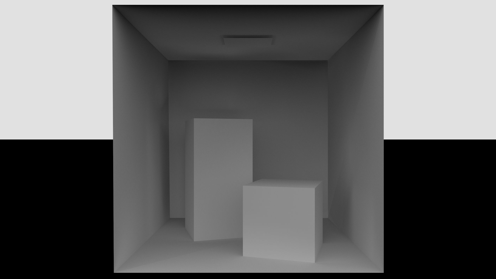
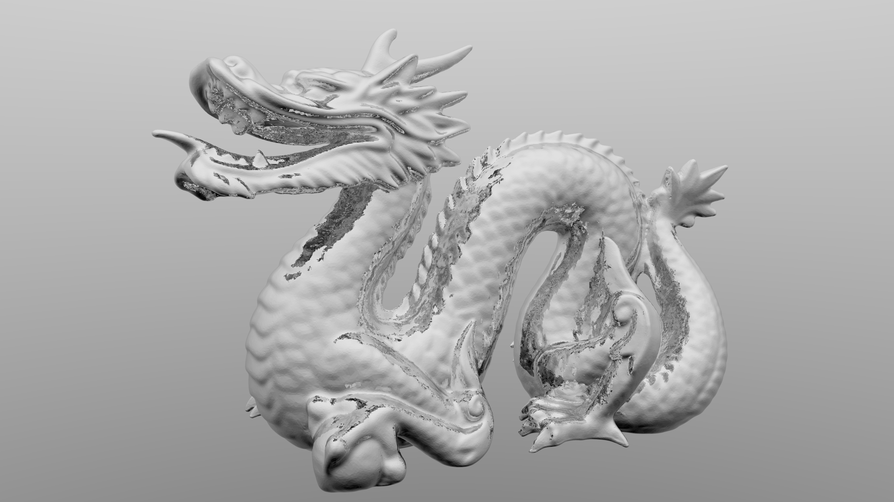

# path_tracer

A path tracer written in C++ and GLSL, using the Vulkan ray tracing extensions.

The [Cornell Box](http://www.graphics.cornell.edu/online/box):


A metallic [Stanford dragon](https://graphics.stanford.edu/data/3Dscanrep/):


## Build

Prerequisites:

- [The Vulkan SDK](https://www.lunarg.com/vulkan-sdk)

All other dependencies are handled
by [CPM.cmake](https://github.com/cpm-cmake/CPM.cmake).

```
git clone https://github.com/mschertenleib/path_tracer.git
cd path_tracer
cmake -S . -B build -DCMAKE_BUILD_TYPE=Release
cmake --build build --target path_tracer
```

## External libraries

- [GLFW](https://github.com/glfw/glfw)
- [Dear ImGui](https://github.com/ocornut/imgui)
- [stb_image](https://github.com/nothings/stb)
- [stb_image_write](https://github.com/nothings/stb)
- [tinyobjloader](https://github.com/tinyobjloader/tinyobjloader)
- [VulkanMemoryAllocator](https://github.com/GPUOpen-LibrariesAndSDKs/VulkanMemoryAllocator)

## References

- [vk_mini_path_tracer](https://github.com/nvpro-samples/vk_mini_path_tracer)
- [smallpt](http://www.kevinbeason.com/smallpt)
- [_Ray Tracing in One
  Weekend_](https://raytracing.github.io/books/RayTracingInOneWeekend.html)
- [_Ray Tracing: The Next
  Week_](https://raytracing.github.io/books/RayTracingTheNextWeek.html)
- [_Ray Tracing: The Rest of Your
  Life_](https://raytracing.github.io/books/RayTracingTheRestOfYourLife.html)
- [_Physically Based Rendering: From Theory To
  Implementation_](https://pbr-book.org)
- [The Cornell Box](http://www.graphics.cornell.edu/online/box)
- [The Stanford 3D Scanning Repository](https://graphics.stanford.edu/data/3Dscanrep/)
- [Vulkan-Tutorial](https://vulkan-tutorial.com)
- [Sascha Willems Vulkan examples](https://github.com/SaschaWillems/Vulkan)
- Möller, Tomas; Trumbore, Ben (1997). _Fast, Minimum Storage Ray-Triangle
  Intersection_. Journal of
  Graphics Tools. 2: 21–28. http://www.graphics.cornell.edu/pubs/1997/MT97.pdf
- https://www.researchgate.net/publication/228610268_Ray-Triangle_Intersection_Algorithm_for_Modern_CPU_Architectures
- Veach, Eric; Guibas, Leonidas J. (1995). _Optimally Combining Sampling
  Techniques for Monte Carlo
  Rendering_. SIGGRAPH 95 Proceedings, Addison-Wesley, pp.
  419-428. https://legacy.sites.fas.harvard.edu/~cs278/papers/veach.pdf
- Dammertz, H., Hanika, J. and Keller, A. (2008), _Shallow Bounding Volume
  Hierarchies for Fast SIMD
  Ray Tracing of Incoherent Rays_. Computer Graphics Forum, 27:
  1225-1233. https://www.uni-ulm.de/fileadmin/website_uni_ulm/iui.inst.100/institut/Papers/QBVH.pdf
- V. Fuetterling, C. Lojewski, F.-J. Pfreundt, A. Ebert, _Efficient Ray Tracing
  Kernels for Modern
  CPU Architectures_, Journal of Computer Graphics Techniques (JCGT), vol. 4,
  no. 4, 91–111,
  2015, https://jcgt.org/published/0004/04/05/
- _A Fast and Robust Method for Avoiding Self-Intersection_
  , https://link.springer.com/content/pdf/10.1007/978-1-4842-4427-2_6.pdf
- _Ray Tracing Gems
  II_, https://link.springer.com/book/10.1007/978-1-4842-7185-8
- https://www.embree.org/papers/2016-HPG-shading.pdf
- http://www.cs.cmu.edu/afs/cs/academic/class/15869-f11/www/readings/wald08_widebvh.pdf
- https://uops.info/

## License

This software is released under [MIT License](LICENSE).
