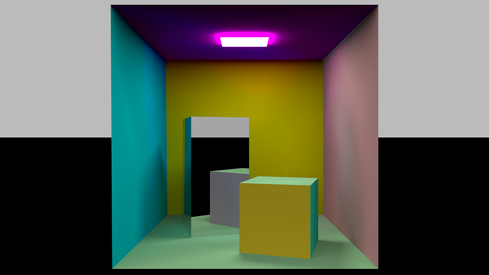

# Path Tracer

A path tracer written in C++ and GLSL, using the Vulkan ray tracing extensions.

The aim of this project is to be able to create unbiased path-traced renders of
a wide range of scenes, using ray tracing hardware on GPUs. The accent will be
put on the rendering itself (i.e. interesting special materials, volumetric
scattering, lens effects, etc.). The scene geometry will be fixed and
not editable from the interface, because this would require a significant amount
of work if we want "nice" controls, i.e. not just editing the values by hand,
and this is not the goal of this project anyway. This also means that
acceleration structures can be optimized for a one-time build of static
geometry, without the need for updates.

We will however probably add a material
editor, to be able to test different materials on the same geometry without the
need to edit it in an external 3D software (and because we might support special
materials that cannot be easily exported in 3D file formats, for instance for
volumetric or spectral rendering). Updating materials is easier to do than
geometry, because it is a simple buffer update, as opposed to an acceleration
structure update. The editor will also allow the selection of
an optional environment map, as well as settings for general rendering
parameters, the camera, etc. Finally, note that lights that are contained within
the scene will simply be emissive objects. If the need appears, we might add
explicit dynamic lights such as beams for interesting optics tests, but it is
not a priority.

We will probably not use instancing for now for simplicity, but this might
become a natural evolution when we allow the editing of materials for individual
meshes, because we will have to handle the scene graph anyway (for now, Assimp
can just pre-transform and merge meshes for us). Note also that instancing might
be required from a performance/memory point of view if we want to render large
scenes with lots of objects.

The [Cornell Box](http://www.graphics.cornell.edu/online/box):


A metallic [Stanford dragon](https://graphics.stanford.edu/data/3Dscanrep/):


## Build

Prerequisites:

- [The Vulkan SDK](https://www.lunarg.com/vulkan-sdk)

All other dependencies are handled
by [CPM.cmake](https://github.com/cpm-cmake/CPM.cmake).

```shell
git clone https://github.com/mschertenleib/path_tracer.git
cd path_tracer
cmake -S . -B build -DCMAKE_BUILD_TYPE=Release
cmake --build build --target path_tracer
```

## External libraries

- [VulkanMemoryAllocator](https://github.com/GPUOpen-LibrariesAndSDKs/VulkanMemoryAllocator) for managing memory allocation for Vulkan
- [GLFW](https://github.com/glfw/glfw) for the window, surface and input
- [Dear ImGui](https://github.com/ocornut/imgui) for the user interface
- [ImGuizmo](https://github.com/CedricGuillemet/ImGuizmo) for gizmo controls
- [stb_image and stb_image_write](https://github.com/nothings/stb) for reading/writing images
- [Open Asset Import Library (assimp)](https://github.com/assimp/assimp) for loading 3D assets
- [tiny file dialogs](https://sourceforge.net/projects/tinyfiledialogs) for open/save file dialogs

## References

- [vk_mini_path_tracer](https://github.com/nvpro-samples/vk_mini_path_tracer)
- [NVIDIA Vulkan Ray Tracing Tutorial](https://nvpro-samples.github.io/vk_raytracing_tutorial_KHR/)
- [smallpt](http://www.kevinbeason.com/smallpt)
- [_Ray Tracing in One
  Weekend_](https://raytracing.github.io/books/RayTracingInOneWeekend.html)
- [_Ray Tracing: The Next
  Week_](https://raytracing.github.io/books/RayTracingTheNextWeek.html)
- [_Ray Tracing: The Rest of Your
  Life_](https://raytracing.github.io/books/RayTracingTheRestOfYourLife.html)
- [_Physically Based Rendering: From Theory To
  Implementation_](https://pbr-book.org)
- [The Cornell Box](http://www.graphics.cornell.edu/online/box)
- [The Stanford 3D Scanning Repository](https://graphics.stanford.edu/data/3Dscanrep/)
- [Vulkan-Tutorial](https://vulkan-tutorial.com)
- [Sascha Willems Vulkan examples](https://github.com/SaschaWillems/Vulkan)
- Möller, Tomas; Trumbore, Ben (1997). _Fast, Minimum Storage Ray-Triangle
  Intersection_. Journal of
  Graphics Tools. 2: 21–28. http://www.graphics.cornell.edu/pubs/1997/MT97.pdf
- https://www.researchgate.net/publication/228610268_Ray-Triangle_Intersection_Algorithm_for_Modern_CPU_Architectures
- Veach, Eric; Guibas, Leonidas J. (1995). _Optimally Combining Sampling
  Techniques for Monte Carlo
  Rendering_. SIGGRAPH 95 Proceedings, Addison-Wesley, pp.
  419-428. https://legacy.sites.fas.harvard.edu/~cs278/papers/veach.pdf
- Dammertz, H., Hanika, J. and Keller, A. (2008), _Shallow Bounding Volume
  Hierarchies for Fast SIMD
  Ray Tracing of Incoherent Rays_. Computer Graphics Forum, 27:
  1225-1233. https://www.uni-ulm.de/fileadmin/website_uni_ulm/iui.inst.100/institut/Papers/QBVH.pdf
- V. Fuetterling, C. Lojewski, F.-J. Pfreundt, A. Ebert, _Efficient Ray Tracing
  Kernels for Modern
  CPU Architectures_, Journal of Computer Graphics Techniques (JCGT), vol. 4,
  no. 4, 91–111,
  2015, https://jcgt.org/published/0004/04/05/
- _A Fast and Robust Method for Avoiding Self-Intersection_
  , https://link.springer.com/content/pdf/10.1007/978-1-4842-4427-2_6.pdf
- _Ray Tracing Gems
  II_, https://link.springer.com/book/10.1007/978-1-4842-7185-8
- https://www.embree.org/papers/2016-HPG-shading.pdf
- http://www.cs.cmu.edu/afs/cs/academic/class/15869-f11/www/readings/wald08_widebvh.pdf
- https://uops.info/

## License

This software is released under [MIT License](LICENSE).

